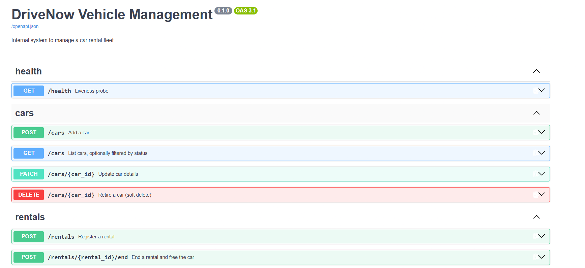
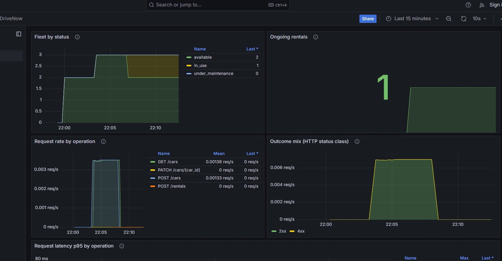
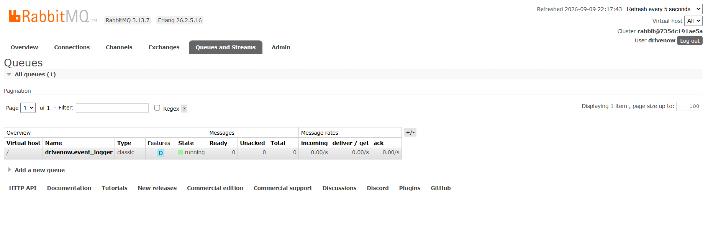
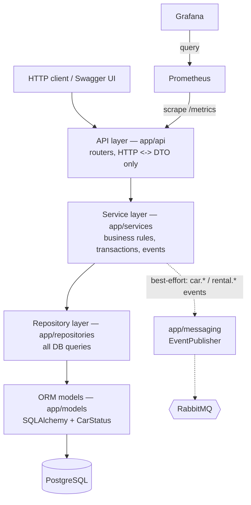

# DriveNow – Vehicle Management System

[](https://github.com/renanaya48/DriveNow/actions/workflows/ci.yml)

Internal service for a car rental company to manage a fleet of vehicles and their
rentals. Built as a clean, layered foundation for future expansion.

> A feature-complete vehicle-management service: REST API, PostgreSQL,
> best-effort RabbitMQ events, Prometheus/Grafana observability, a one-command
> Docker Compose stack, and CI. Architecture and trade-offs:
> [docs/architecture.md](docs/architecture.md).

**Repository:** https://github.com/renanaya48/DriveNow

*Short on time? Read [Highlights](#highlights) →
[Architecture at a glance](#architecture-at-a-glance) → [Quickstart](#quickstart)
→ [Screenshots](#screenshots).*

## Highlights

- **Layered architecture** — HTTP, business rules, persistence and infrastructure
  stay separate, so each layer is swappable and testable in isolation.
- **Unit-of-Work transactions** — creating a rental and flipping the car's status
  commit atomically or not at all.
- **Explicit CAR→RENTAL lock ordering** — every lifecycle operation takes the
  same locks in the same order, which keeps concurrent acquisition consistent and
  reduces deadlock risk.
- **Best-effort messaging by design** — a RabbitMQ outage never blocks a rental;
  the publish is logged and the consumer reconnects on its own.
- **Observability built in** — `prometheus-client` metrics feed a *provisioned*
  Grafana dashboard: request latency, outcome mix, fleet state, active rentals.
- **159 tests, branch-aware coverage with a 95% gate, CI** on every push.

## Tech stack

| Concern | Choice |
|---|---|
| API | FastAPI + Uvicorn |
| Database | PostgreSQL via SQLAlchemy 2.0 + Alembic |
| Metrics | prometheus-client (`/metrics`) |
| Message queue | RabbitMQ (pika) |
| Dependency management | Poetry |
| Tests | pytest (branch coverage, 95% gate) |
| Packaging | Docker + docker-compose |
| Observability | Prometheus + Grafana (provisioned) |
| CI | GitHub Actions (ruff · mypy · pytest · docker build) |

Why PostgreSQL: the data is relational (`rentals.car_id` → `cars`), rental
registration needs an atomic "create rental + flip car status" transaction, and
DB constraints keep invalid data out. Full rationale in
[docs/architecture.md](docs/architecture.md#5-why-postgresql).

## Quickstart

```bash
git clone --branch feature/vehicle-management-system https://github.com/renanaya48/DriveNow.git
cd DriveNow
docker compose up --build
```

*(Once the branch is merged in step 13, `--branch …` is no longer needed.)*

Open [Swagger](http://localhost:8000/docs) and [Grafana](http://localhost:3000).
Run the demo flow in [Using the API](#using-the-api) to add a car, start/end a
rental, and watch the metrics and consumer log update.

## Screenshots

| | |
|---|---|
|  |  |
| *Swagger UI — the six endpoints.* | *Grafana — the provisioned **DriveNow** dashboard.* |



*RabbitMQ — the durable `drivenow.event_logger` queue (bound to the
`drivenow.events` topic exchange) consuming events.*

## Architecture at a glance



Dependencies point one way only (API → Service → Repository → Models). The
sequence diagrams, SOLID mapping and schema are in
[docs/architecture.md](docs/architecture.md).

## Using the API

Interactive docs (Swagger UI) at `http://localhost:8000/docs` once the server is
up — every operation can be run there with **Try it out**, no `curl` needed.

```bash
BASE=http://localhost:8000
TODAY=$(date +%F)
NEXT_WEEK=$(date -d '+7 days' +%F)   # macOS: date -v+7d +%F

# Add a car
curl -sX POST $BASE/cars -H 'content-type: application/json' \
  -d '{"model": "Toyota Corolla", "year": 2023}'
# -> 201 {"id":1,"model":"Toyota Corolla","year":2023,"status":"available", ...}

# List cars (optional ?status=available|in_use|under_maintenance)
curl -s $BASE/cars
curl -s "$BASE/cars?status=available"

# Update a car (partial; e.g. send it for maintenance)
curl -sX PATCH $BASE/cars/1 -H 'content-type: application/json' \
  -d '{"status": "under_maintenance"}'

# Register a rental (start_date must be today)
curl -sX POST $BASE/rentals -H 'content-type: application/json' \
  -d "{\"car_id\": 1, \"customer_name\": \"Dana\", \"start_date\": \"$TODAY\", \"end_date\": \"$NEXT_WEEK\"}"
# -> 201 {"id":1,"car_id":1,"returned_date":null,"is_active":true, ...}   (car is now in_use)

# End the rental (frees the car)
curl -sX POST $BASE/rentals/1/end
# -> 200 {"id":1,"returned_date":"<today>","is_active":false, ...}        (car is available again)

# Retire a car (soft delete; blocked while it has an active rental)
curl -isX DELETE $BASE/cars/1        # -> 204 No Content
```

Example responses:

`POST /cars` → **201 Created**

```json
{
  "id": 1,
  "model": "Toyota Corolla",
  "year": 2023,
  "status": "available",
  "created_at": "2026-09-09T10:25:11Z",
  "updated_at": "2026-09-09T10:25:11Z"
}
```

`POST /rentals` → **201 Created** (car 1 is now `in_use`)

```json
{
  "id": 1,
  "car_id": 1,
  "customer_name": "Dana",
  "start_date": "2026-09-09",
  "end_date": "2026-09-16",
  "returned_date": null,
  "is_active": true,
  "created_at": "2026-09-09T10:25:12Z",
  "updated_at": "2026-09-09T10:25:12Z"
}
```

`PATCH /cars/99` → **404 Not Found**

```json
{ "detail": "car 99 not found" }
```

Errors carry `{"detail": "<message>"}`: `404` unknown car/rental, `409` state
conflict (car not available, illegal status change, car has an active rental,
rental already ended), `422` invalid input or a broken date rule.

## Run it

### Local (Poetry)

```bash
poetry install
cp .env.example .env
poetry run uvicorn app.main:app --reload --port 8000
```

- API docs (Swagger): http://localhost:8000/docs
- Health: http://localhost:8000/health
- Metrics: http://localhost:8000/metrics

> The API needs a database. Point `DATABASE_URL` at one (`docker compose up -d db`,
> or a local file: `export DATABASE_URL=sqlite:///./dev.db`), then
> `poetry run alembic upgrade head`.

### Docker

```bash
docker compose up --build
```

Six services on one network:

| Service | Port | What it is |
|---|---|---|
| `api` | http://localhost:8000 ([/docs](http://localhost:8000/docs)) | the FastAPI app |
| `grafana` | http://localhost:3000 | **DriveNow** dashboard (login `drivenow` / `drivenow`, or anonymous read-only) |
| `prometheus` | http://localhost:9090 | scrapes `api:8000/metrics` every 15s |
| `rabbitmq` | http://localhost:15672 | management UI (`drivenow` / `drivenow`) |
| `db` | 5432 | PostgreSQL |
| `consumer` | — | event-logging worker (`docker compose logs -f consumer`) |

The `api` container runs `alembic upgrade head` on start (see
`docker/entrypoint.sh`) before Uvicorn; the `consumer` skips migrations (no DB).
The image runs as a non-root user and carries a `/health` `HEALTHCHECK`. `api`
waits only for `db` to be healthy — **RabbitMQ being down does not stop the API**
(publishing is best-effort; the consumer reconnects when the broker returns).

> Published ports, the `drivenow`/`drivenow` credentials and Grafana's anonymous
> view are a local-demo convenience, not a production security posture.

## Project layout

```
app/
  api/          FastAPI routers, DI providers, HTTP error mapping
  services/     business logic + domain exceptions
  repositories/ data access layer
  models/       SQLAlchemy models, CarStatus enum
  schemas/      Pydantic request/response DTOs
  messaging/    EventPublisher (Protocol), NullPublisher, consumer worker
  core/         config, logging, metrics
  main.py       application factory
tests/          pytest suite
docs/           architecture.md, img/
```

## Database & migrations

Schema is managed with **Alembic**. The DB URL comes from `DATABASE_URL`
(`app/core/config.py`); `alembic/env.py` reads it, so there is one source of truth.

```bash
poetry run alembic upgrade head            # apply all migrations
poetry run alembic downgrade base          # revert everything
poetry run alembic revision --autogenerate -m "describe change"   # new migration
poetry run alembic current                 # show applied revision
```

Tables: `cars`, `rentals` (see [docs/architecture.md](docs/architecture.md#schema)).
Models live in `app/models/`; a DB session is obtained via the `get_db` FastAPI
dependency (`app/core/db.py`).

## Logs

Every successful critical action (car added / updated / retired, rental started /
ended) writes one `INFO` line, in the same format to **stdout and**
`logs/app.log` (`RotatingFileHandler`, 5 MB × 3 backups):

```
2026-09-09T10:25:29+0300 | INFO     | app.services.rental_service | rental started rental_id=1 car_id=1 start=2026-09-09 end=2026-09-16
```

Rejected requests log a `WARNING`; unexpected errors log an `ERROR` with a
traceback (and return `500 {"detail": "internal server error"}` — no stack trace
in the response). Verbosity is set with `LOG_LEVEL` (default `INFO`). Messages
carry IDs and dates, never customer names.

## Metrics

`GET /metrics` exposes Prometheus text (default registry):

| Metric | Meaning |
|---|---|
| `drivenow_cars{status="…"}` | non-deleted fleet cars by status. `sum(drivenow_cars)` = active fleet; `drivenow_cars{status="available"}` = available now |
| `drivenow_ongoing_rentals` | rentals with no return date |
| `drivenow_request_duration_seconds{operation="…"}` | request latency histogram. Average = `rate(drivenow_request_duration_seconds_sum[5m]) / rate(drivenow_request_duration_seconds_count[5m])` |
| `drivenow_operations_total{operation,outcome}` | requests by route template and HTTP status class (e.g. `2xx`/`4xx`/`5xx`) |

The gauges are recomputed from the DB on every scrape. `/metrics`, `/health` and
the docs routes are not timed. `docker compose` wires these into **Prometheus**
(:9090) and a provisioned **Grafana** dashboard (:3000).

## Message queue

The service layer emits a domain event after each successful action, through the
`EventPublisher` abstraction (`app/messaging/`):

| Event | Payload |
|---|---|
| `car.added` / `car.deleted` | `{"car_id": int}` |
| `car.updated` | `{"car_id": int, "changed": [field, …]}` |
| `rental.started` / `rental.ended` | `{"rental_id": int, "car_id": int}` |

- **`ENABLE_MESSAGE_QUEUE`** (default `false`) selects the implementation:
  `false` → `NullPublisher` (events dropped, no broker needed — this is what the
  tests and a bare `uvicorn` run use); `true` → `RabbitMQPublisher`, which
  publishes to the durable topic exchange `drivenow.events` at **`RABBITMQ_URL`**.
- Publishing is **best-effort**: it runs after the DB commit, with bounded
  timeouts and one reconnect-retry; a failure is logged (`ERROR`) and the HTTP
  request still succeeds. Guaranteed delivery would need a transactional outbox
  (see [docs/architecture.md](docs/architecture.md#6-cross-cutting-concerns)).
- The **consumer** (`python -m app.messaging.consumer`) binds a durable queue
  `drivenow.event_logger` to every event and logs one line per message.

Watch it end to end:

```bash
docker compose up --build
docker compose logs -f consumer     # wait for "consumer ready: … queue=drivenow.event_logger"

curl -sX POST http://localhost:8000/cars -H 'content-type: application/json' \
  -d '{"model": "Toyota Corolla", "year": 2023}'
# consumer log: event received event_type=car.added id=… payload={'car_id': 1}
```

The RabbitMQ management UI (`http://localhost:15672`, **drivenow / drivenow**)
shows the `drivenow.events` exchange and the `drivenow.event_logger` queue. Start
the consumer before generating events — an event published with no queue bound is
unroutable and dropped.

## Tests

```bash
poetry run pytest                        # full quality gate: all tests + branch coverage, fails under 95%
poetry run pytest tests/test_api.py --no-cov   # focused run, no coverage gate
```

The assignment asks for **≥ 4 unit tests**; the suite has **159** across every
layer at **99.8% branch-aware coverage** (`pyproject.toml` sets a 95% floor via
`--cov-fail-under=95`). One file per layer:

| File | Covers |
|---|---|
| `test_models.py` | ORM models ↔ `0001` migration (no schema drift) |
| `test_schemas.py` | Pydantic request/response DTOs |
| `test_repositories.py` | repository queries (soft-delete filter, active-rental lookups, counts) |
| `test_services.py` | business rules + transaction rollback + best-effort events |
| `test_api.py` | HTTP status codes and the `DomainError → 4xx` mapping |
| `test_logging.py` | one INFO line per action, no PII, WARNING/ERROR paths |
| `test_metrics.py` | `/metrics` output and the timing middleware |
| `test_messaging.py` | RabbitMQ publisher (envelope, retry) + consumer (validate/ack/nack, reconnect) |
| `test_db.py` | session lifecycle and engine connect args |
| `test_smoke.py` | app wiring + lifespan shutdown |

Tests run entirely offline — in-memory SQLite via SQLAlchemy, no database daemon,
no broker, no Docker. See [docs/architecture.md](docs/architecture.md#7-testing).

## Lint / type-check

```bash
poetry run ruff check .
poetry run mypy app
```

## Roadmap

| # | Step |
|---|---|
| 0–1 | Architecture + project skeleton *(done)* |
| 2 | DB models, session, Alembic migration *(done)* |
| 3 | Repository layer *(done)* |
| 4 | Pydantic DTOs *(done)* |
| 5 | Service layer (car + rental lifecycle) *(done)* |
| 6 | REST endpoints *(done)* |
| 7 | Logging of critical actions *(done)* |
| 8 | Prometheus metrics *(done)* |
| 9 | RabbitMQ publisher + consumer *(done)* |
| 10 | Unit tests (≥ 4) + coverage gate *(done)* |
| 11 | Docker polish: non-root image, Prometheus + Grafana, CI *(done)* |
| 12 | README: diagrams, examples, screenshots *(done)* |
| 13 | Open PR `feature/vehicle-management-system` → `main` |
