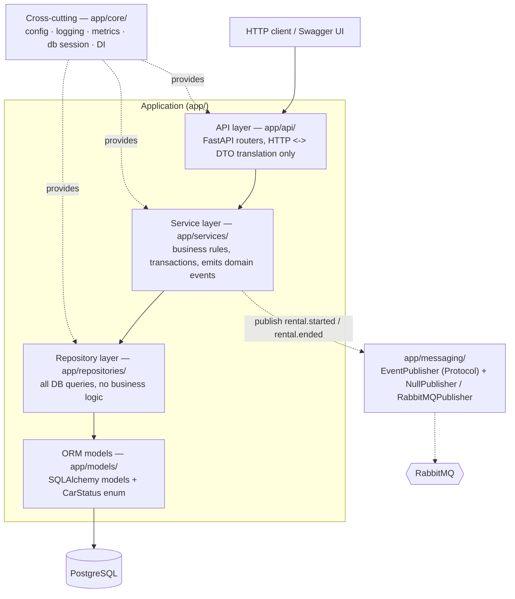
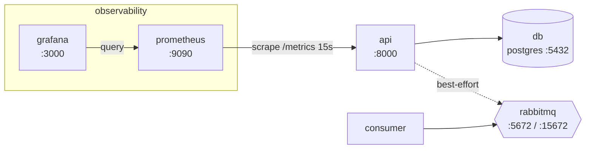

# DriveNow – Architecture

## 1. Goal

An internal system for **DriveNow**, a car rental company, to manage a fleet of
vehicles and their rentals. It must be a clean foundation for future expansion,
so the design puts **separation of concerns** and **SOLID** first.

## 2. Layered architecture

Dependencies point in **one direction only** – every layer knows the layer
directly beneath it and never the one above. This lets us swap a layer's
implementation (a different DB, a different message broker) and test each layer
in isolation.



| Layer | Package | Responsibility | Must NOT do |
|---|---|---|---|
| API | `app/api/` | Parse/validate HTTP, call a service, map result/errors to status codes | Business rules, DB access |
| Service | `app/services/` | Enforce business rules, own the DB transaction (Unit of Work), publish events | Know about HTTP, write raw SQL |
| Repository | `app/repositories/` | CRUD + queries against the ORM | Business decisions, commit/rollback policy |
| Models | `app/models/` | Table definitions, column types, `CarStatus` enum | Any logic |
| Cross-cutting | `app/core/` | Settings, logging, metrics, DB session factory, DI providers | Domain rules |
| Messaging | `app/messaging/` | Publish/consume domain events | Be a hard dependency of the request path (best-effort) |

<a id="schema"></a>

### 2.1 Database schema

Managed by Alembic (`alembic/versions/0001_create_cars_and_rentals.py`). Models in
`app/models/`. `CarStatus` maps to `VARCHAR` + a named `CHECK`
(`native_enum=False, create_constraint=True`), storing the enum *values*
(`values_callable`), so the same models run on PostgreSQL and on SQLite (tests).

```
cars
  id           INTEGER  PK
  model        VARCHAR(100)   NOT NULL
  year         INTEGER        NOT NULL
  status       VARCHAR(20)    NOT NULL  DEFAULT 'available'
                 CHECK status IN ('available','in_use','under_maintenance')  (car_status)
  created_at   TIMESTAMPTZ    NOT NULL  DEFAULT now()
  updated_at   TIMESTAMPTZ    NOT NULL  DEFAULT now()
  deleted_at   TIMESTAMPTZ    NULL       -- soft delete: NULL => in fleet
                                         [index ix_cars_deleted_at]

rentals
  id             INTEGER  PK
  car_id         INTEGER        NOT NULL  -> cars(id)        [index ix_rentals_car_id]
  customer_name  VARCHAR(200)   NOT NULL
  start_date     DATE           NOT NULL   -- agreed term, set at registration
  end_date       DATE           NOT NULL   -- agreed term, set at registration
  returned_date  DATE           NULL       -- set when the rental is ended;
                                           -- NULL => still active
                                           [index ix_rentals_returned_date]
  created_at     TIMESTAMPTZ    NOT NULL  DEFAULT now()
  updated_at     TIMESTAMPTZ    NOT NULL  DEFAULT now()
  CHECK end_date >= start_date                              (ck_rentals_end_after_start)
  CHECK returned_date IS NULL OR returned_date >= start_date (ck_rentals_returned_after_start)
  UNIQUE (car_id) WHERE returned_date IS NULL               (uq_rentals_one_active_per_car)
```

**Active rental** = row with `returned_date IS NULL`. Keeping `returned_date`
separate from the agreed `end_date` lets us later detect late returns
(`returned_date > end_date`). The partial unique index enforces **at most one
open rental per car** at the DB level.

**Car removal is a soft delete.** `deleted_at` is stamped instead of deleting the
row, so rental history is never lost and a retired car stays reachable through
`Rental.car`. The `Car.rentals` relationship uses the default cascade only —
removing a car must never touch its rentals.

### 2.2 Repository layer

`app/repositories/` — one narrow interface per aggregate, each backed by a
SQLAlchemy implementation (same shape as `EventPublisher` / `NullPublisher`):

- `CarRepository`: `add`, `get_by_id`, `get_by_id_for_update`, `list(status=None)`, `update`, `soft_delete`, `count_by_status`
- `RentalRepository`: `add`, `get_by_id`, `get_by_id_for_update`, `get_active_by_car`, `list_active`, `update`, `count_active`

Rules:

- Plain Python — **no FastAPI imports**. The session is passed to `__init__`.
- `flush()` to assign PKs / surface constraint errors, but **never `commit` /
  `rollback`** — the transaction (Unit of Work) belongs to the service.
- Return ORM models, never DTOs. "Not found" → return `None`, never raise;
  mapping `None` → `CarNotFoundError` is the service's job.
- `get_by_id_for_update` issues `SELECT … FOR UPDATE` (PostgreSQL row lock;
  no-op on SQLite). Step 5's `register_rental` uses it to serialise concurrent
  bookings of the same car.
- Every `CarRepository` read filters out `deleted_at IS NOT NULL`. `soft_delete`
  stamps `deleted_at`; whether a car *may* be removed (e.g. not while it has an
  active rental) is a business rule enforced by the service in step 5.

### 2.3 API schemas (DTOs)

`app/schemas/` — Pydantic v2 models, one triad per aggregate:

- **`*Create`** — required fields only, no `id` / timestamps. `CarCreate` is
  `model` + `year`; `status` is *not* accepted (a new car is always
  `AVAILABLE` — `IN_USE` only results from registering a rental).
- **`*Update`** — every field optional (PATCH). Empty body `{}` is a valid
  no-op. A field sent explicitly as `null` is rejected (those columns are
  `NOT NULL`); "not sent" ≠ "sent as null".
- **`*Read`** — the shape returned to clients: `id`, timestamps, and computed
  fields (`RentalRead.is_active`, from the ORM property — never stored twice).
  `CarRead` omits `deleted_at` (deleted cars are not returned at all).

Why DTOs are separate from the ORM models: the ORM describes *storage*; the DTO
describes *what a client may send and what we choose to show*. The split gives
over-posting protection, edge validation, and a wire format that stays stable
when the tables change.

Request DTOs subclass `StrictModel` (`extra="forbid"`) — an unknown / over-posted
field is a `422`, not silently dropped. Response DTOs subclass `ORMModel`
(`from_attributes=True`) so they build straight from an ORM instance.

**Three layers of validation:**

| Layer | Question it answers | Examples |
|---|---|---|
| Pydantic (DTO) | Is the request *structurally* valid? | types, `year` in range, non-empty name, `end_date >= start_date`, no unknown fields |
| Service (step 5) | Is the *operation* allowed? | car exists / not soft-deleted / is `AVAILABLE`; rental not already ended; legal status transition |
| Database | Can invalid persisted state still be prevented? | `NOT NULL`, FK, `CHECK` |

The service does not skip validation — it owns the business invariants.

### 2.4 Service layer

`app/services/` — `CarService` (`add_car`, `update_car`, `list_cars`,
`delete_car`) and `RentalService` (`register_rental`, `end_rental`). Plain Python,
no FastAPI. Each service holds a `UnitOfWork` + the repositories + an
`EventPublisher`, all sharing one DB session.

**Transaction ownership.** Repositories `flush` but never commit. Each service
method runs its repository calls inside `_transaction()`: commit on a clean exit,
`rollback()` + re-raise on any exception. Events are published **after** commit
and are **best-effort** — a publish failure is logged, never rolls anything back.
*Event publication is deliberately best-effort for this assignment; a production
system needing guaranteed delivery would use the transactional outbox pattern.*

**Concurrency — global lock order: CAR → RENTAL.** Every lifecycle operation
takes the car row lock (`get_by_id_for_update`, `SELECT … FOR UPDATE` on
PostgreSQL, no-op on SQLite) so they serialise:

| Operation | Locks (in order) |
|---|---|
| `update_car` / `delete_car` / `register_rental` | car |
| `end_rental` | unlocked read of the rental for its `car_id` → **car** → re-read rental **for update** (`populate_existing`) → validate the locked rental |

Every operation needing both locks acquires them in the **same** order
(CAR → RENTAL); no operation acquires them in the opposite order, so there is no
lock-order cycle.

**One open rental per car** is guarded in three layers:

1. `car.status == AVAILABLE` check;
2. explicit `rentals.get_active_by_car` after the lock — this is what converts an
   inconsistent row (`AVAILABLE` yet an open rental exists) into a domain-level
   `CarNotAvailableError`;
3. the partial unique index `uq_rentals_one_active_per_car` — the final database
   integrity backstop (it raises `IntegrityError` if the code path ever reaches it).

**Status transitions** (enforced by `update_car`): `AVAILABLE ↔ UNDER_MAINTENANCE`
only; `IN_USE` is entered by `register_rental` and left by `end_rental`. A
same-value or empty update is a no-op — no write, no event.

**`register_rental` starts a rental today** — not a reservation system, not
historical import: `dto.start_date` must equal today.

**Domain events** (minimal payloads; the publisher wraps each one in an
id/timestamp envelope — see section 6):

| Event | Payload |
|---|---|
| `car.added` / `car.deleted` | `{"car_id": int}` |
| `car.updated` | `{"car_id": int, "changed": [field, …]}` |
| `rental.started` / `rental.ended` | `{"rental_id": int, "car_id": int}` |

### 2.5 API layer

`app/api/` — FastAPI routers, one per aggregate. Each route is
`result = service.<method>(dto | id)` → `return <Read>.model_validate(result)`;
**no business logic in a route**. The service is injected via
`Annotated[Service, Depends(get_*_service)]` — `app/api/deps.py` is the only place
`Depends` appears and the only composition root (one `Session` shared by the Unit
of Work + both repositories).

| Method | Path | Service call | Success |
|---|---|---|---|
| POST | `/cars` | `add_car` | `201` `CarRead` |
| GET | `/cars?status=` | `list_cars` | `200` `CarRead[]` |
| PATCH | `/cars/{id}` | `update_car` | `200` `CarRead` |
| DELETE | `/cars/{id}` | `delete_car` | `204` |
| POST | `/rentals` | `register_rental` | `201` `RentalRead` |
| POST | `/rentals/{id}/end` | `end_rental` | `200` `RentalRead` |

Path IDs are `Annotated[int, Path(gt=0)]` → `/cars/0` is a `422` at the edge.
`DomainError → HTTP` is mapped once, in `app/api/errors.py`
(`404` not-found · `409` state conflict · `422` `RentalDateError`), body
`{"detail": "<message>"}`. Pydantic request-validation failures use FastAPI's
default `422` (`{"detail": [ … ]}`).

## 3. Key flows

### 3.1 Register a rental — `POST /rentals`

```mermaid
sequenceDiagram
    participant C as Client
    participant API as API (rentals router)
    participant S as RentalService
    participant CR as CarRepository
    participant RR as RentalRepository
    participant DB as PostgreSQL
    participant P as EventPublisher

    C->>API: POST /rentals {car_id, customer_name, start_date, end_date}
    API->>S: register_rental(dto)
    Note over S: reject unless start_date == today (RentalDateError)
    S->>CR: get_by_id_for_update(car_id)  %% SELECT ... FOR UPDATE
    CR->>DB: SELECT car FOR UPDATE
    alt car missing / soft-deleted
        S-->>API: CarNotFoundError
        API-->>C: 404
    else car.status != available OR open rental exists
        S-->>API: CarNotAvailableError
        API-->>C: 409
    else ok
        S->>RR: add(rental)  %% returned_date = NULL
        S->>CR: car.status = in_use ; update(car)
        S->>DB: uow.commit()  %% one atomic transaction
        S->>P: publish("rental.started", {...})  %% best-effort, after commit
        S-->>API: Rental
        API-->>C: 201 RentalRead
    end
```

### 3.2 End a rental — `POST /rentals/{id}/end`

```mermaid
sequenceDiagram
    participant C as Client
    participant API as API (rentals router)
    participant S as RentalService
    participant CR as CarRepository
    participant RR as RentalRepository
    participant DB as PostgreSQL
    participant P as EventPublisher

    C->>API: POST /rentals/{id}/end
    API->>S: end_rental(id)
    S->>RR: get_by_id(id)  %% unlocked, to discover car_id
    alt rental missing
        S-->>API: RentalNotFoundError
        API-->>C: 404
    else ok
        S->>CR: get_by_id_for_update(car_id)   %% lock CAR first
        S->>RR: get_by_id_for_update(id)       %% then lock + re-read RENTAL
        alt rental.returned_date is not null
            S-->>API: RentalAlreadyEndedError
            API-->>C: 409
        else ok
            S->>RR: rental.returned_date = today() ; update(rental)
            S->>CR: car.status = available ; update(car)
            S->>DB: uow.commit()
            S->>P: publish("rental.ended", {...})
            S-->>API: Rental
            API-->>C: 200 RentalRead
        end
    end
```

## 4. SOLID in this codebase

| Principle | Where |
|---|---|
| **S**ingle Responsibility | `CarService` vs `RentalService`; one router per domain; repositories only query |
| **O**pen/Closed | New event consumers or a new publisher backend added without touching services |
| **L**iskov Substitution | `NullPublisher` and `RabbitMQPublisher` are fully interchangeable behind `EventPublisher` |
| **I**nterface Segregation | Narrow repository interfaces – only the methods a service needs |
| **D**ependency Inversion | Services depend on the `EventPublisher` protocol and repository abstractions rather than concrete implementations. Concrete dependencies are assembled in the API composition root (`app/api/deps.py`) using FastAPI `Depends` |

## 5. Why PostgreSQL

- The data is **inherently relational**: `rentals.car_id` is a foreign key to `cars`,
  and the common query is "active rentals for a car".
- **Transactional integrity matters**: registering a rental must create the rental
  row *and* flip the car's status atomically. A relational DB with ACID
  transactions gives this for free.
- **Constraints as guardrails**: FK constraints, `NOT NULL`, a `CHECK` on
  `status`, and `CHECK (end_date >= start_date)` stop invalid data at the DB level.
- SQLAlchemy 2.0 + Alembic give a clean ORM boundary and versioned migrations,
  so swapping the concrete engine later is a config change, not a rewrite.

A document store (MongoDB) would push join logic and referential integrity into
application code – more work for no benefit at this shape and scale.

## 6. Cross-cutting concerns

- **Logging** (`app/core/logging.py`): stdlib `logging` + `dictConfig`, one
  format to **console and** `logs/app.log` (rotating, 5 MB × 3); level via
  `LOG_LEVEL`. Messages carry context as `key=value` (IDs, `changed`, dates —
  **never** `customer_name`). Who logs what:

  | Situation | Level | Emitted by |
  |---|---|---|
  | successful business action (car added/updated/retired, rental started/ended) | `INFO` | the service, after commit |
  | request rejected by a business rule (`DomainError`) | `WARNING` | the `DomainError` handler (`app/api/errors.py`) |
  | unexpected exception → `500` | `ERROR` + traceback | the generic `Exception` handler |
  | event publish failed | `ERROR` + traceback | the `_publish` helper in `CarService` / `RentalService` (best-effort) |

  It is an operational trace, not a durable/immutable audit store. Uvicorn's own
  loggers are left untouched.
- **Metrics** (`app/core/metrics.py`, `app/api/metrics.py`, `app/api/middleware.py`):
  `prometheus_client` on the default registry, exposed at **`GET /metrics`** (a
  real route, so it can query the DB).

  | Metric | Type | Fed by |
  |---|---|---|
  | `drivenow_cars{status}` | gauge | scrape-time `COUNT` — non-deleted cars by status. Active fleet = `sum(...)`; available = `{status="available"}` |
  | `drivenow_ongoing_rentals` | gauge | scrape-time `COUNT` — `returned_date IS NULL` |
  | `drivenow_request_duration_seconds{operation}` | histogram | `MetricsMiddleware`; average latency = `rate(_sum)/rate(_count)` |
  | `drivenow_operations_total{operation, outcome}` | counter | `MetricsMiddleware`; `outcome` is the HTTP status class (e.g. `2xx` / `4xx` / `5xx`) |

  Gauges are recomputed from the DB on every scrape (accurate, restart-safe,
  no service changes). `MetricsMiddleware` is a **pure-ASGI** middleware (not
  `BaseHTTPMiddleware`) that records **exactly one** sample per request, labelled
  by the matched route template (`POST /cars`, `PATCH /cars/{car_id}`), and
  **skips** `/metrics`, `/health`, `/docs`, `/docs/oauth2-redirect`,
  `/openapi.json`, `/redoc`.
- **Messaging** (`app/messaging/`): domain events published best-effort after a
  successful commit; a failure to publish is logged, never fatal to the request.

  **Publisher.** The service layer depends only on the `EventPublisher`
  protocol. `app/api/deps.py::get_event_publisher` (cached, one per process)
  returns `RabbitMQPublisher` when `ENABLE_MESSAGE_QUEUE` is true, else
  `NullPublisher` — so the app runs with no broker by default and every test
  injects its own publisher.

  `RabbitMQPublisher` (blocking `pika`) publishes to a **durable topic
  exchange** `drivenow.events`, routing key = the event type. Each event is
  wrapped in a JSON envelope
  `{"id": <uuid>, "event_type": <str>, "occurred_at": <ISO-8601 UTC>, "payload": <dict>}`
  and sent persistent (`delivery_mode=2`), `mandatory=True`, with
  `confirm_delivery()` — an unroutable or unconfirmed publish raises. One
  lazily-opened connection is reused across requests, guarded by a
  `threading.Lock` (the routers are sync `def`, so FastAPI runs them in a
  threadpool and blocking `pika` + a lock are the right primitives).
  Timeouts are bounded (`socket_timeout` / `blocked_connection_timeout` ≈ 3s,
  `connection_attempts=1`) so an unavailable broker fails the publish in ~3s
  instead of stalling the request. On a connection-level error
  (`AMQPConnectionError`, `StreamLostError`, `ChannelWrongStateError`, `OSError`)
  it resets and retries **once**; semantic/topology failures
  (`ChannelClosedByBroker`), `UnroutableError` / `NackError` and serialization
  errors are **not** retried — a reconnect would not fix them. Either way the
  exception surfaces to `CarService._publish`, which logs `ERROR` and lets the
  HTTP response succeed.

  **Consumer** (`python -m app.messaging.consumer`, its own process /
  compose service). Declares the same exchange and a **durable queue**
  `drivenow.event_logger` bound with `#` (all events), `prefetch_count=10`. Per
  message: validate the envelope → one INFO line
  (`event received event_type=… id=… payload=…`) → `basic_ack`. A malformed
  body is logged and dropped with `basic_nack(requeue=False)` — a poison
  message must not loop. SIGTERM/SIGINT set a `threading.Event` and call
  `stop_consuming()`; a broker outage reconnects after a 5s backoff unless
  shutdown was requested during it.

  **Payload contract.** Event payloads carry only **operational IDs / non-PII
  fields** (`car_id`, `rental_id`, `changed`) — the logging consumer records the
  payload, so `customer_name` and similar never go on the wire.

  **Known limitations.** Delivery is best-effort: an event published before the
  consumer has declared its queue is unroutable and dropped, and a publish that
  fails after the DB commit is lost. Guaranteed at-least-once delivery would need
  the **transactional outbox** pattern (write the event to an `outbox` table in
  the same transaction, relay it asynchronously) — deliberately out of scope
  here.

  ```mermaid
  flowchart LR
      svc["CarService / RentalService\n(after commit, best-effort)"]
      pub["RabbitMQPublisher\nenvelope + confirm"]
      ex{{"exchange drivenow.events\n(topic, durable)"}}
      q["queue drivenow.event_logger\n(durable, bind #)"]
      con["consumer\nvalidate -> log -> ack"]
      svc -->|publish event_type, payload| pub -->|routing_key = event_type| ex --> q --> con
  ```

## 7. Testing

One test file per layer, all offline (no PostgreSQL, no broker, no Docker). The
assignment asks for ≥ 4 unit tests; the suite has **159** across every layer at
**99.8% branch-aware coverage**, with a **95% floor** (`--cov-fail-under=95` in
`pyproject.toml`).

| File | Layer under test | What a failure here means |
|---|---|---|
| `test_models.py` | ORM models + the `0001` migration | schema drift: a column / CHECK / index / FK differs between the models and `alembic upgrade head` |
| `test_schemas.py` | Pydantic DTOs | a request shape the API should accept/reject changed (year range, empty name, `extra="forbid"`, `end_date >= start_date`, explicit `null`) |
| `test_repositories.py` | `SqlAlchemy*Repository` | a query changed behaviour: soft-delete filtering, `get_active_by_car`, `count_by_status`, ordering |
| `test_services.py` | `CarService` / `RentalService` | a business rule or the transaction boundary broke: status transitions, one-open-rental, `start_date == today`, rollback-on-error, best-effort events |
| `test_api.py` | FastAPI routers + `errors.py` | wrong HTTP status / body: the `DomainError → 404/409/422` mapping, `Path(gt=0)`, `204` on delete |
| `test_logging.py` | logging call sites | a critical action stopped logging, started logging PII, or a rejection stopped being `WARNING` |
| `test_metrics.py` | `/metrics` + `MetricsMiddleware` | a gauge/counter changed name or label, or the middleware stopped recording exactly one sample per request |
| `test_messaging.py` | `RabbitMQPublisher` + consumer | envelope format, retry policy, topology declarations, or the "signal prevents reconnect" guarantee regressed |
| `test_db.py` | `get_db` / `get_engine` | the session stopped being closed, or the sqlite `connect_args` branch changed |
| `test_smoke.py` | app wiring + lifespan | the app stopped building, or shutdown stopped closing the publisher |

**In-memory SQLite, not the production DB.** `conftest.py` builds a fresh
`sqlite://` engine per test (`StaticPool` so every session shares the one
in-memory DB, a `connect` hook turning on `PRAGMA foreign_keys`). Because
`CarStatus` is mapped `native_enum=False` with a `CHECK`, the *same* models and
the *same* migration run on SQLite. These are integration tests **of our code
against a real SQL engine** — they exercise our queries, constraints and
transaction handling, but they are **not** tests against PostgreSQL and **not** a
test of real `SELECT … FOR UPDATE` concurrency (that behaviour is designed and
documented in §2.4, and is a no-op on SQLite).

**Test doubles** (hand-written, no framework): `SpyPublisher` records emitted
events; `RaisingPublisher` proves a publish failure never breaks the operation;
`ExplodingOnUpdate` wraps a real repository but throws on `update()` to force the
rollback path. HTTP tests use `TestClient` with
`app.dependency_overrides[get_db]` pointed at the in-memory session and cleared
in a `finally`.

**Not covered by design:** real broker / Docker end-to-end, load and
concurrency, and a handful of genuinely defensive guards marked
`# pragma: no cover` (e.g. the rental row disappearing between its discovery
read and the locked re-read).

**CI** (`.github/workflows/ci.yml`) runs the same three commands on every push
plus a `docker build --target runtime` and a `docker compose config` — the only
place the container build is actually exercised.

## 8. Running in Docker

### 8.1 Image

A 3-stage `Dockerfile` (`base` → `builder` → `runtime`). The `builder`
`poetry export`s the locked runtime deps and `pip install`s them into an
isolated virtualenv `/opt/venv`; `runtime` copies **only** that venv plus
`app/`, `alembic/` and the entrypoint — Poetry and the export plugin never reach
the final image. It runs as a non-root user (`appuser`, uid 1000) and carries a
stdlib `HEALTHCHECK` against `/health`.

`docker/entrypoint.sh` (the `api` service only) runs `alembic upgrade head` once,
then `exec`s the CMD (`uvicorn`). This is fine for a single instance / local
Compose; a multi-replica deployment would run migrations as a separate
job/step so parallel containers don't race the same upgrade.

### 8.2 Compose topology



- **`api` depends on `db` health only.** Postgres is core — no DB, nothing to
  serve. RabbitMQ is **not** a startup dependency: the broker being down must not
  stop the API (§6/§9 — publishing is best-effort, the `RabbitMQPublisher`
  connects lazily, the `consumer` reconnects with backoff).
- **`consumer`** shares the image but overrides the entrypoint
  (`python -m app.messaging.consumer`) and disables the inherited healthcheck (no
  HTTP server); it *does* wait for `rabbitmq` to be healthy.
- **`prometheus`** scrapes `api:8000/metrics` every 15s
  (`docker/prometheus.yml`). **`grafana`** auto-provisions the Prometheus
  datasource and the **DriveNow** dashboard from `docker/grafana/` — fleet by
  status, ongoing rentals, request rate, outcome mix, p95 latency, all built on
  the §6 metrics.
- Persistent named volumes: `db_data`, `api_logs`, `prom_data`, `grafana_data`.

Published ports, the `drivenow`/`drivenow` credentials and Grafana's anonymous
`Viewer` access are a local-demo convenience — **not** a production security
posture.
