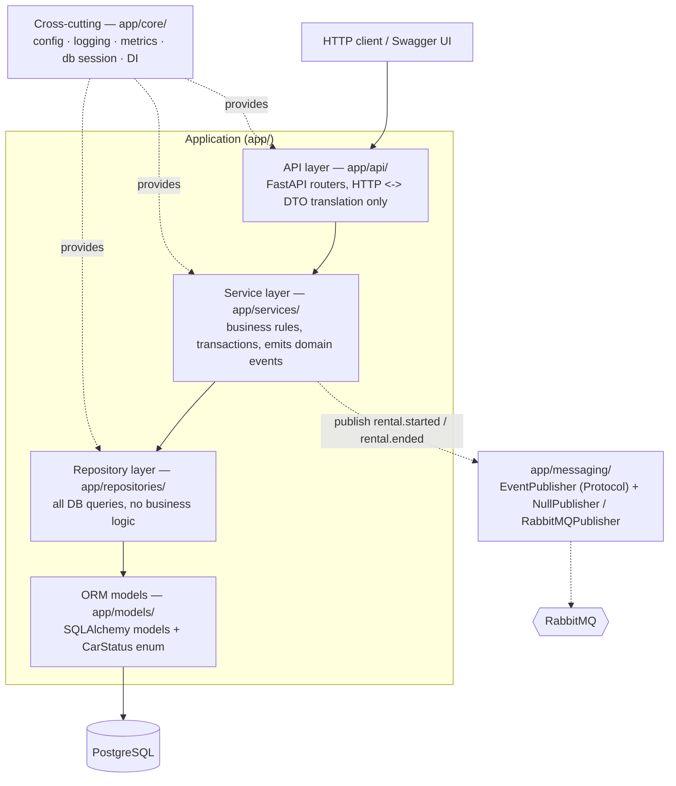
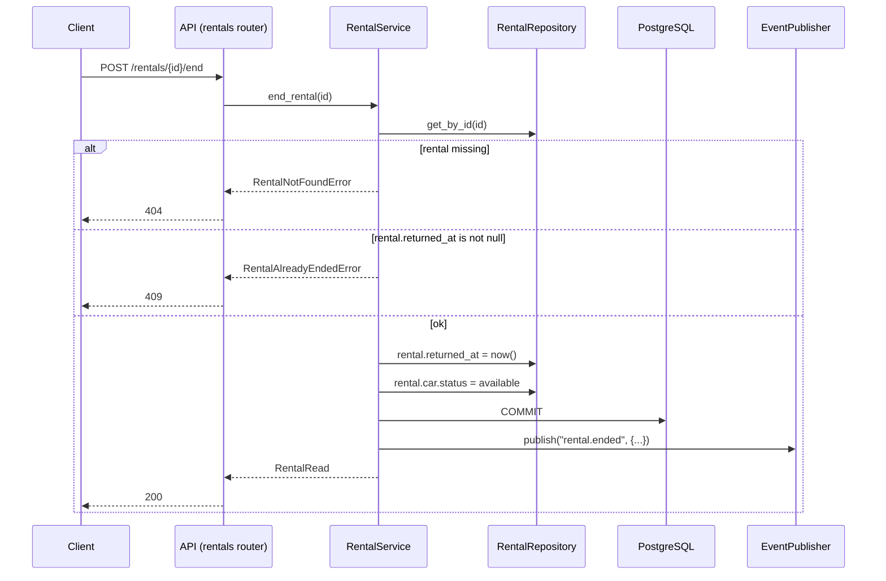

# DriveNow – Architecture

## 1. Goal

An internal system for **DriveNow**, a car rental company, to manage a fleet of
vehicles and their rentals. It must be a clean foundation for future expansion,
so the design puts **separation of concerns** and **SOLID** first.

## 2. Layered architecture

Dependencies point in **one direction only** – every layer knows the layer
directly beneath it and never the one above. This lets us swap a layer's
implementation (a different DB, a different message broker) and test each layer
in isolation.



| Layer | Package | Responsibility | Must NOT do |
|---|---|---|---|
| API | `app/api/` | Parse/validate HTTP, call a service, map result/errors to status codes | Business rules, DB access |
| Service | `app/services/` | Enforce business rules, own the DB transaction (Unit of Work), publish events | Know about HTTP, write raw SQL |
| Repository | `app/repositories/` | CRUD + queries against the ORM | Business decisions, commit/rollback policy |
| Models | `app/models/` | Table definitions, column types, `CarStatus` enum | Any logic |
| Cross-cutting | `app/core/` | Settings, logging, metrics, DB session factory, DI providers | Domain rules |
| Messaging | `app/messaging/` | Publish/consume domain events | Be a hard dependency of the request path (best-effort) |

<a id="schema"></a>

### 2.1 Database schema

Managed by Alembic (`alembic/versions/0001_create_cars_and_rentals.py`). Models in
`app/models/`. `CarStatus` is stored as `VARCHAR` + `CHECK` (`native_enum=False`)
so the same models run on PostgreSQL and on SQLite (tests).

```
cars
  id           INTEGER  PK
  model        VARCHAR(100)   NOT NULL
  year         INTEGER        NOT NULL
  status       VARCHAR(20)    NOT NULL  DEFAULT 'available'
                 CHECK status IN ('available','in_use','under_maintenance')
  created_at   TIMESTAMPTZ    NOT NULL  DEFAULT now()
  updated_at   TIMESTAMPTZ    NOT NULL  DEFAULT now()

rentals
  id             INTEGER  PK
  car_id         INTEGER        NOT NULL  -> cars(id)        [index ix_rentals_car_id]
  customer_name  VARCHAR(200)   NOT NULL
  start_at       TIMESTAMPTZ    NOT NULL   -- agreed term (date + time), set at registration
  end_at         TIMESTAMPTZ    NOT NULL   -- agreed term (date + time), set at registration
  returned_at    TIMESTAMPTZ    NULL       -- set when the rental is ended;
                                           -- NULL => still active
                                           [index ix_rentals_returned_at]
  created_at     TIMESTAMPTZ    NOT NULL  DEFAULT now()
  updated_at     TIMESTAMPTZ    NOT NULL  DEFAULT now()
  CHECK end_at >= start_at                (ck_rentals_end_after_start)
```

**Active rental** = row with `returned_at IS NULL`. Keeping `returned_at` separate
from the agreed `end_at` lets us later detect late returns
(`returned_at > end_at`).

## 3. Key flows

### 3.1 Register a rental — `POST /rentals`

```mermaid
sequenceDiagram
    participant C as Client
    participant API as API (rentals router)
    participant S as RentalService
    participant CR as CarRepository
    participant RR as RentalRepository
    participant DB as PostgreSQL
    participant P as EventPublisher

    C->>API: POST /rentals {car_id, customer_name, start_at, end_at}
    API->>S: register_rental(dto)
    S->>CR: get_by_id(car_id)
    CR->>DB: SELECT car
    alt car missing
        S-->>API: CarNotFoundError
        API-->>C: 404
    else car.status != available
        S-->>API: CarNotAvailableError
        API-->>C: 409
    else ok
        S->>RR: add(rental)  %% start_at, end_at from request; returned_at = NULL
        S->>CR: car.status = in_use
        S->>DB: COMMIT (single transaction)
        S->>P: publish("rental.started", {...})  %% best-effort, after commit
        S-->>API: RentalRead
        API-->>C: 201
    end
```

### 3.2 End a rental — `POST /rentals/{id}/end`



## 4. SOLID in this codebase

| Principle | Where |
|---|---|
| **S**ingle Responsibility | `CarService` vs `RentalService`; one router per domain; repositories only query |
| **O**pen/Closed | New event consumers or a new publisher backend added without touching services |
| **L**iskov Substitution | `NullPublisher` and `RabbitMQPublisher` are fully interchangeable behind `EventPublisher` |
| **I**nterface Segregation | Narrow repository interfaces – only the methods a service needs |
| **D**ependency Inversion | Services depend on the `EventPublisher` protocol and repository abstractions, injected via FastAPI `Depends`, not on concrete classes |

## 5. Why PostgreSQL

- The data is **inherently relational**: `rentals.car_id` is a foreign key to `cars`,
  and the common query is "active rentals for a car".
- **Transactional integrity matters**: registering a rental must create the rental
  row *and* flip the car's status atomically. A relational DB with ACID
  transactions gives this for free.
- **Constraints as guardrails**: FK constraints, `NOT NULL`, a `CHECK` on
  `status`, and `CHECK (end_at >= start_at)` stop invalid data at the DB level.
- SQLAlchemy 2.0 + Alembic give a clean ORM boundary and versioned migrations,
  so swapping the concrete engine later is a config change, not a rewrite.

A document store (MongoDB) would push join logic and referential integrity into
application code – more work for no benefit at this shape and scale.

## 6. Cross-cutting concerns

- **Logging** (`app/core/logging.py`): stdlib `logging`, `dictConfig`, console +
  `RotatingFileHandler` to `logs/app.log`. Services log add/update/rental
  lifecycle/errors.
- **Metrics** (`app/core/metrics.py`): `prometheus_client` exposed at `/metrics` –
  available cars (gauge), ongoing rentals (gauge), request/operation latency
  (histogram), operation counters.
- **Messaging** (`app/messaging/`): domain events published best-effort after a
  successful commit; a failure to publish is logged, never fatal to the request.
